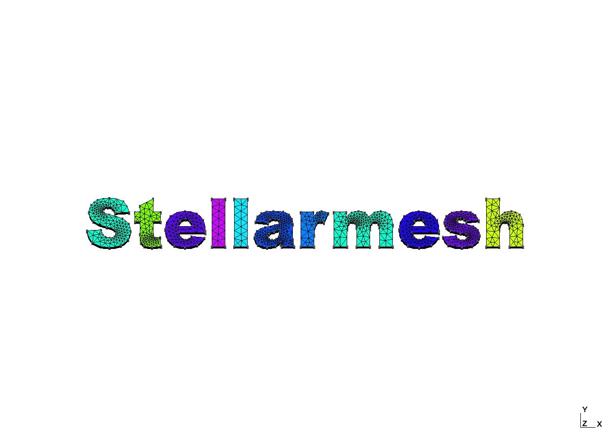

:warning: This library does not yet have a stable release.

Stellarmesh is a Gmsh wrapper and DAGMC geometry creator for fusion neutronics workflows, inspired by [cad-to-dagmc](https://github.com/fusion-energy/cad_to_dagmc) and [cad-to-openmc](https://github.com/openmsr/CAD_to_OpenMC).

**Notable features**:
- Correctly implements surface sense

# Examples

See `examples.py`.

# Other libraries

- Jonathan Shimwell's [CAD-to-DAGMC](https://github.com/fusion-energy/cad_to_dagmc)
- Erik B. Knudsen's [CAD-to-OpenMC](https://github.com/openmsr/CAD_to_OpenMC)
