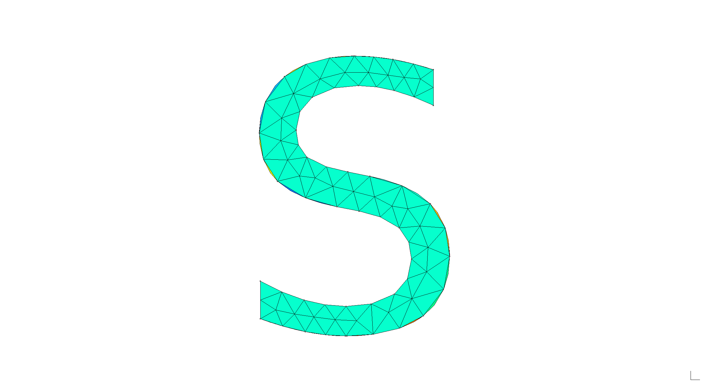
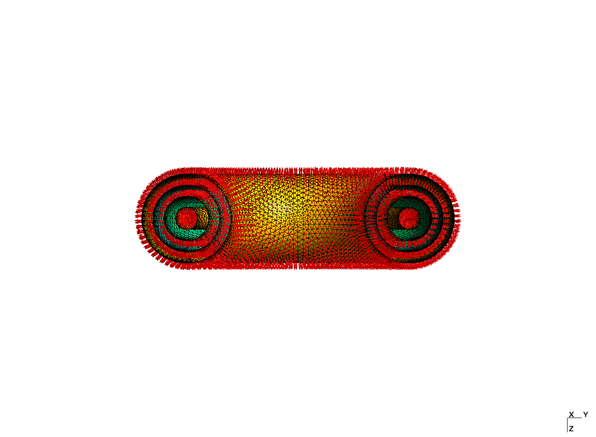

# Stellarmesh

<p align="center">

</p>

:warning: This library is in development. Expect breaking changes and bugs, and feel free to contribute.

Stellarmesh is a Gmsh wrapper and DAGMC geometry creator for fusion neutronics workflows, building on other libraries such as [cad-to-dagmc](https://github.com/fusion-energy/cad_to_dagmc) and [cad-to-openmc](https://github.com/openmsr/CAD_to_OpenMC) in an attempt to reach feature parity with the [Cubit plugin](https://github.com/svalinn/Cubit-plugin).

**Progress**:

- [x] Correctly implements surface sense
- [x] Imprinting and merging of conformal geometry
- [ ] Programatic manipulation of .h5m tags e.g. materials

# Examples

<details>
<summary>Module imports and configuration</summary>

```python
import build123d as bd
import stellarmesh as sm
import logging
import sys

try:
    from ocp_vscode import show
except:
    print("ocp_vscode not installed, not showing geometry.")


def show_or_skip(*args, **kwargs):
    if "ocp_vscode" in sys.modules:
        try:
            show(*args, **kwargs)
        except:
            print("OCP viewer not available, skipping.")


# Required to show logging in Jupyter
logging.basicConfig()
logging.getLogger("stellarmesh").setLevel(logging.WARN)
```

</details>

## Simple torus geometry

```python
solids = [bd.Solid.make_torus(1000, 100)]
for i in range(3):
    solids.append(solids[-1].faces()[0].thicken(100))
solids = solids[1:]
show_or_skip(solids, transparent=True)

geometry = sm.Geometry(solids)
mesh = sm.Mesh.mesh_geometry(geometry, min_mesh_size=50, max_mesh_size=50)
mesh.render("doc/torus-mesh.png", rotation_xyz=(90, 0, -90), normals=15)
h5m = sm.DAGMCGeometry.make_from_mesh(mesh, material_names=["a", "b", "c"])
```

<p align="center">
 <br> <em>Volumes are properly
tagged with surface sense.</em>
</p>

<details>
<summary>Check overlaps</summary>

```{bash}
❯ overlap_check dagmc.h5m

NOTICE:
     Performing overlap check using triangle vertex locations only.
     Use the '-p' option to check more points on the triangle edges.
     Run '$ overlap_check --help' for more information.

Running overlap check:
100% |===============================================================>|+
No overlaps were found.
```

</details>

<details>
<summary>Check materials</summary>

```{bash}
❯ mbsize -ll dagmc.h5m | grep mat:|

NAME = mat:a
NAME = mat:b
NAME = mat:c
```

</details>

<details>
<summary>Check watertight</summary>

```{bash}
❯ check_watertight dagmc.h5m

number of surfaces=4
number of volumes=3

0/0 (nan%) unmatched edges
0/4 (0%) unsealed surfaces
0/3 (0%) unsealed volumes
leaky surface ids=
leaky volume ids=
0.173068 seconds
```

</details>

## Stellarmesh logo

```python
cmp = bd.Compound.make_text("Stellarmesh", 14, font="Arial Black")
solids = [f.thicken(10) for f in cmp.faces()]
show_or_skip(solids)

geometry = sm.Geometry(solids)
mesh = sm.Mesh.mesh_geometry(geometry, min_mesh_size=1, max_mesh_size=2)
mesh.render("doc/logo.png", rotation_xyz=(0, -2, 0), clipping=False)
```

<p align="center">

</p>

# Other libraries

- Jonathan Shimwell’s
  [CAD-to-DAGMC](https://github.com/fusion-energy/cad_to_dagmc)
- Erik B. Knudsen’s
  [CAD-to-OpenMC](https://github.com/openmsr/CAD_to_OpenMC)
